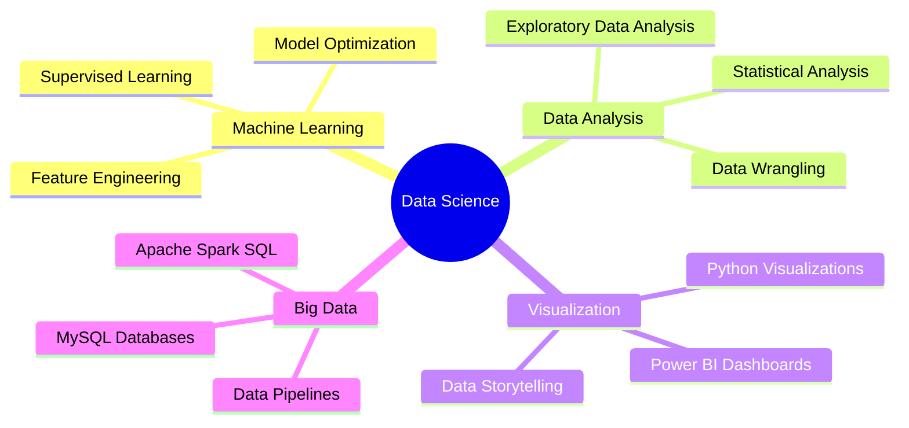

<div align="center">

# 👋 Hi, I'm Priscilla Naadu Lartey

### Data Scientist | Machine Learning Engineer | Problem Solver

[](https://www.linkedin.com/in/larteypriscilla/)
[](mailto:naadu51@gmail.com)
[](https://github.com/yourusername)


</div>

---

## 🚀 About Me

```python
class DataScientist:
    def __init__(self):
        self.name = "Priscilla Naadu Lartey"
        self.role = "Data Scientist"
        self.passion = ["Machine Learning", "Data Analytics", "AI Solutions"]
        self.current_focus = "Building predictive models for real-world impact"
        
    def say_hi(self):
        print("Thanks for dropping by! Let's turn data into decisions.")

me = DataScientist()
me.say_hi()
```

I'm a **data scientist** passionate about uncovering insights through data and building intelligent machine learning models. My expertise spans **machine learning**, **statistical analysis**, and **data visualization**, with a focus on creating AI solutions that solve real-world problems.

Currently enhancing my skills in **predictive modeling**, **deep learning**, and **big data analytics** to contribute to impactful projects that leverage the power of AI.

---

## 🛠️ Tech Stack

<div align="center">

### **Languages & Libraries**


### **Data Visualization**


### **Databases & Tools**


</div>

---

## 💼 Core Competencies



---

## 🔬 Featured Projects

<table>
<tr>
<td width="50%">

### 🏠 Energy Efficiency Predictive Modeling
**Objective:** Predict heating and cooling loads for optimal building energy efficiency

**Tech Stack:** `Python` `Scikit-learn` `Pandas` `Regression Models`

**Key Achievements:**
- ✅ Engineered features from building design parameters
- ✅ Achieved high prediction accuracy for energy consumption
- ✅ Identified key factors influencing thermal performance

</td>
<td width="50%">

### 🛡️ Cyberbully Detection System
**Objective:** NLP model to identify and flag cyberbullying content on social media

**Tech Stack:** `Python` `NLP` `Scikit-learn` `Text Processing`

**Key Achievements:**
- ✅ Processed and cleaned large-scale tweet datasets
- ✅ Implemented text classification algorithms
- ✅ Built robust model for real-time detection

</td>
</tr>
</table>

---

## 📊 GitHub Analytics

<div align="center">


</div>

<div align="center">


</div>

---

## 🌱 Currently Learning

- 🧠 Deep Learning & Neural Networks
- 📈 Advanced Time Series Analysis
- ☁️ Cloud Computing (AWS/Azure for ML)
- 🤖 Large Language Models (LLMs)

---

## 📫 Let's Connect!

<div align="center">

I'm always excited to collaborate on data science projects, discuss ML innovations, or explore opportunities to create impact with AI!

[](https://www.linkedin.com/in/larteypriscilla/)
[](mailto:naadu51@gmail.com)

**💡 "Data is the new oil, but insights are the refined fuel that drives innovation."**

</div>

---

<div align="center">


*⭐ From [Priscilla Naadu Lartey](https://github.com/yourusername) - Let's build the future with data!*

</div>
